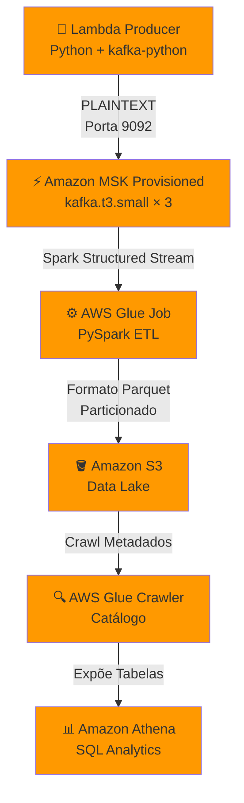

# Laboratório Prático: Pipeline de Dados Real-Time com MSK Provisioned
**Curso:** Pós-Tech AI Scientist  
**Duração Estimada:** 2 Horas (19h às 21h)  
**Escopo:** Provisionamento do Amazon MSK Provisioned (Kafka), Ingestão e Geração de Eventos em Tempo Real, Processamento de Streaming com AWS Glue Job (PySpark), Catalogação e Orquestração Serverless com AWS Step Functions.


## O Cenário

Imagine que você é o engenheiro de dados de um banco digital. A cada segundo, milhares de transações financeiras acontecem: compras no cartão, transferências PIX, saques em caixas eletrônicos. No meio desse fluxo massivo de dados, **fraudadores** estão agindo — clonando cartões, fazendo compras internacionais suspeitas, simulando transferências legítimas.

O desafio: como detectar essas fraudes **em tempo real**, antes que o dinheiro desapareça?

A resposta está em um **pipeline de streaming** — um sistema que ingere, processa e analisa cada transação à medida que ela acontece, sem esperar por batches de fim de dia. É exatamente isso que vamos construir neste laboratório.

### O que vamos construir

Um pipeline completo que simula o backend de um sistema antifraude:

- **Gerador de transações** (Lambda) → publica eventos no Kafka a cada 5 minutos
- **Stream processing** (Glue/Spark) → consome, enriquece e grava em tempo real
- **Data Lake** (S3/Parquet) → armazena dados particionados por hora
- **Consulta** (Athena) → SQL sobre os dados para análise de fraudes

**Cada transação contém:** ID do usuário, valor, moeda, tipo (débito/crédito/transferência), comerciante, país, categoria, **fraud score** (0 a 1) e flag de transação internacional. O pipeline enriquece os dados com `is_high_fraud_risk` (score > 0.7) e `is_high_value` (valor > R$2.000) — campos que um modelo de ML usaria para decidir se bloqueia a transação.

## Visão Geral da Arquitetura



## PRÉ-REQUISITO: Configurar AWS CLI

```bash
aws sts get-caller-identity
# Se não funcionar, configure:
# aws configure --profile fiap-lab
```

### Variáveis de Ambiente

```bash
export AWS_REGION=us-east-1
export aws_access_key_id=$(aws sts get-caller-identity --query Account --output text)
export BUCKET_NAME=fiap-msk-provisioned-lab-$aws_access_key_id
export SG_NAME=fiap-msk-provisioned-sg
export CLUSTER_NAME=fiap-msk-provisioned
export JOB_NAME=fiap-glue-msk-streaming
export CRAWLER_NAME=fiap-crawler-msk
export SFN_NAME=Pipeline-MSK-Orchestrator

echo "aws_access_key_id=$aws_access_key_id  REGION=$AWS_REGION"
```

> **Sessão nova?** Recupere as variáveis ( só utilizar em caso deperca da sessão do terminal ):
> ```bash
> export AWS_REGION=us-east-1
> export aws_access_key_id=$(aws sts get-caller-identity --query Account --output text)
> export BUCKET_NAME=fiap-msk-provisioned-lab-$aws_access_key_id
> export SG_NAME=fiap-msk-provisioned-sg
> export CLUSTER_NAME=fiap-msk-provisioned
> export JOB_NAME=fiap-glue-msk-streaming
> export CRAWLER_NAME=fiap-crawler-msk
> export SFN_NAME=Pipeline-MSK-Orchestrator
> export VPC_ID=$(aws ec2 describe-vpcs --filters "Name=tag:Name,Values=fiap-msk-vpc" \
>   --region $AWS_REGION --query 'Vpcs[0].VpcId' --output text)
> export SUBNET_1=$(aws ec2 describe-subnets --filters "Name=tag:Name,Values=fiap-msk-subnet-1" \
>   --region $AWS_REGION --query 'Subnets[0].SubnetId' --output text)
> export SUBNET_2=$(aws ec2 describe-subnets --filters "Name=tag:Name,Values=fiap-msk-subnet-2" \
>   --region $AWS_REGION --query 'Subnets[0].SubnetId' --output text)
> export SG_ID=$(aws ec2 describe-security-groups --filters "Name=group-name,Values=$SG_NAME" \
>   --region $AWS_REGION --query 'SecurityGroups[0].GroupId' --output text)
> export CLUSTER_ARN=$(aws kafka list-clusters --region $AWS_REGION \
>   --query "ClusterInfoList[?ClusterName=='$CLUSTER_NAME'].ClusterArn" --output text)
> export BOOTSTRAP=$(aws kafka get-bootstrap-brokers --cluster-arn $CLUSTER_ARN \
>   --region $AWS_REGION --query 'BootstrapBrokerString' --output text)
> export ROLE_ARN=$(aws iam get-role --role-name AWSGlueServiceRole --query 'Role.Arn' --output text)
> echo "VPC=$VPC_ID SUBNET1=$SUBNET_1 SUBNET2=$SUBNET_2 SG=$SG_ID"
> echo "CLUSTER=$CLUSTER_ARN"
> echo "BOOTSTRAP=$BOOTSTRAP"
> ```

---

## 0. Criar VPC e Subnets

O **Amazon MSK** roda dentro de uma VPC (Virtual Private Cloud) — uma rede virtual isolada na AWS. Os brokers Kafka não são acessíveis pela internet; toda comunicação acontece via rede privada. Isso garante segurança sem expor o cluster a ataques externos.

Nesta seção criamos a infraestrutura de rede necessária para o pipeline:
- **VPC** com bloco CIDR `/16` (65.536 endereços disponíveis)
- **2 Subnets em AZs diferentes** — o MSK distribui brokers entre elas para alta disponibilidade. Se uma AZ cair, o Kafka continua operando na outra.
- **Internet Gateway + Route Table** — permitem que recursos na VPC acessem a internet (necessário para o Glue baixar dependências e para criar a Lambda via Console)

```bash
# VPC
export VPC_ID=$(aws ec2 create-vpc \
  --cidr-block 10.0.0.0/16 \
  --tag-specifications 'ResourceType=vpc,Tags=[{Key=Name,Value=fiap-msk-vpc}]' \
  --region $AWS_REGION --query 'Vpc.VpcId' --output text)

aws ec2 modify-vpc-attribute --vpc-id $VPC_ID --enable-dns-hostnames --region $AWS_REGION
aws ec2 modify-vpc-attribute --vpc-id $VPC_ID --enable-dns-support --region $AWS_REGION
echo "VPC: $VPC_ID"

# Subnets em 2 AZs
AZ_ARRAY=($(aws ec2 describe-availability-zones \
  --filters "Name=state,Values=available" \
  --region $AWS_REGION --query 'AvailabilityZones[0:2].ZoneName' --output text))

export SUBNET_1=$(aws ec2 create-subnet --vpc-id $VPC_ID \
  --cidr-block 10.0.1.0/24 --availability-zone ${AZ_ARRAY[0]} \
  --tag-specifications 'ResourceType=subnet,Tags=[{Key=Name,Value=fiap-msk-subnet-1}]' \
  --region $AWS_REGION --query 'Subnet.SubnetId' --output text)

export SUBNET_2=$(aws ec2 create-subnet --vpc-id $VPC_ID \
  --cidr-block 10.0.2.0/24 --availability-zone ${AZ_ARRAY[1]} \
  --tag-specifications 'ResourceType=subnet,Tags=[{Key=Name,Value=fiap-msk-subnet-2}]' \
  --region $AWS_REGION --query 'Subnet.SubnetId' --output text)

echo "Subnets: $SUBNET_1 (${AZ_ARRAY[0]})  $SUBNET_2 (${AZ_ARRAY[1]})"

# Internet Gateway + Route Table
export IGW_ID=$(aws ec2 create-internet-gateway \
  --tag-specifications 'ResourceType=internet-gateway,Tags=[{Key=Name,Value=fiap-msk-igw}]' \
  --region $AWS_REGION --query 'InternetGateway.InternetGatewayId' --output text)

aws ec2 attach-internet-gateway --internet-gateway-id $IGW_ID --vpc-id $VPC_ID --region $AWS_REGION

export ROUTE_TABLE_ID=$(aws ec2 create-route-table --vpc-id $VPC_ID \
  --tag-specifications 'ResourceType=route-table,Tags=[{Key=Name,Value=fiap-msk-rt}]' \
  --region $AWS_REGION --query 'RouteTable.RouteTableId' --output text)

aws ec2 associate-route-table --subnet-id $SUBNET_1 --route-table-id $ROUTE_TABLE_ID --region $AWS_REGION
aws ec2 associate-route-table --subnet-id $SUBNET_2 --route-table-id $ROUTE_TABLE_ID --region $AWS_REGION
aws ec2 create-route --route-table-id $ROUTE_TABLE_ID --destination-cidr-block 0.0.0.0/0 --gateway-id $IGW_ID --region $AWS_REGION

echo "Rede pronta: IGW=$IGW_ID RT=$ROUTE_TABLE_ID"
```

---

## 1. S3 Bucket

O **Amazon S3** é o destino final dos dados processados — nosso Data Lake. O Glue Job lê transações do Kafka, transforma em formato Parquet (columnar, comprimido, otimizado para analytics) e grava aqui, particionado por ano/mês/dia/hora.

O bucket precisa existir antes dos outros recursos porque tanto o Glue (para scripts e dados) quanto a Lambda (para o Layer) dependem dele.

```bash
aws s3api create-bucket --bucket "$BUCKET_NAME" --region "$AWS_REGION"
# Nota: us-east-1 não precisa de LocationConstraint

aws s3api put-bucket-versioning --bucket "$BUCKET_NAME" \
  --versioning-configuration Status=Enabled
echo "Bucket: $BUCKET_NAME"
```

---

## 2. Security Group

O **Security Group** é o firewall virtual que controla qual tráfego pode entrar e sair dos recursos na VPC. Para o MSK funcionar com clientes (Lambda e Glue), precisamos liberar:

- **Porta 9092** — protocolo Kafka PLAINTEXT (dados e metadados)
- **Porta 2181** — ZooKeeper (gerenciamento interno do cluster)
- **Auto-referência (0-65535)** — permite que workers do Glue (que ficam no mesmo SG) se comuniquem livremente com os brokers sem restrição de porta

```bash
export SG_ID=$(aws ec2 create-security-group \
  --group-name "$SG_NAME" \
  --description "SG for MSK Provisioned lab" \
  --vpc-id "$VPC_ID" \
  --query 'GroupId' --output text --region $AWS_REGION)

# Porta 9092 = Kafka PLAINTEXT
aws ec2 authorize-security-group-ingress --group-id $SG_ID \
  --protocol tcp --port 9092 --cidr 10.0.0.0/16 --region $AWS_REGION

# Porta 2181 = ZooKeeper
aws ec2 authorize-security-group-ingress --group-id $SG_ID \
  --protocol tcp --port 2181 --cidr 10.0.0.0/16 --region $AWS_REGION

# Tráfego interno (Glue workers)
aws ec2 authorize-security-group-ingress --group-id $SG_ID \
  --protocol tcp --port 0-65535 --source-group $SG_ID --region $AWS_REGION

echo "SG: $SG_ID"
```

---

## 3. Criar Cluster MSK Provisioned

O **Amazon MSK Provisioned** é a versão gerenciada do Apache Kafka onde você escolhe tipo de instância, número de brokers e capacidade de storage. A AWS gerencia patches, monitoramento e replicação, mas você controla a configuração.

Para este lab usamos:
- **kafka.t3.small** — instância mais barata (~$0.07/hora), suficiente para demonstração
- **2 brokers** — um por AZ, garantindo alta disponibilidade
- **PLAINTEXT** — sem criptografia nem autenticação (simplifica o lab, não recomendado em produção)
- **10 GB de storage** — mínimo necessário

> **Tempo de provisionamento:** ~15-20 minutos. O cluster passa pelos estados `CREATING` → `ACTIVE`.

```bash
aws kafka create-cluster \
  --cluster-name "$CLUSTER_NAME" \
  --kafka-version "3.7.x" \
  --number-of-broker-nodes 2 \
  --broker-node-group-info "{
    \"InstanceType\": \"kafka.t3.small\",
    \"ClientSubnets\": [\"$SUBNET_1\", \"$SUBNET_2\"],
    \"SecurityGroups\": [\"$SG_ID\"],
    \"StorageInfo\": {\"EbsStorageInfo\": {\"VolumeSize\": 10}}
  }" \
  --encryption-info "{\"EncryptionInTransit\":{\"ClientBroker\":\"PLAINTEXT\",\"InCluster\":false}}" \
  --region $AWS_REGION

echo "Cluster criado. Aguarde ~15 min para ficar ACTIVE..."
```

### Aguardar cluster ficar ACTIVE

```bash
# Repetir até aparecer ACTIVE
aws kafka list-clusters --region $AWS_REGION \
  --query "ClusterInfoList[?ClusterName=='$CLUSTER_NAME'].State" --output text

# Quando ACTIVE, capturar ARN e Bootstrap
export CLUSTER_ARN=$(aws kafka list-clusters --region $AWS_REGION \
  --query "ClusterInfoList[?ClusterName=='$CLUSTER_NAME'].ClusterArn" --output text)

export BOOTSTRAP=$(aws kafka get-bootstrap-brokers --cluster-arn $CLUSTER_ARN \
  --region $AWS_REGION --query 'BootstrapBrokerString' --output text)

echo "CLUSTER_ARN=$CLUSTER_ARN"
echo "BOOTSTRAP=$BOOTSTRAP"
```

---

## 4. Criar Lambda (Producer)

A **Lambda** é o gerador de eventos do pipeline — simula o sistema de pagamentos do banco publicando transações financeiras sintéticas no Kafka. No mundo real, esse papel seria feito pelo gateway de pagamentos, app do banco, ou sistema de cartões.

Usamos Lambda porque:
- **Serverless** — sem servidores para gerenciar
- **Agendável** — EventBridge dispara a cada 5 minutos
- **Barata** — centavos por execução
- **Na VPC** — acesso direto ao MSK sem expor o Kafka à internet

### 4.1 - IAM Role

A role define **o que a Lambda pode fazer**. Com PLAINTEXT, não precisamos de permissões Kafka específicas — o acesso é controlado pela rede (VPC + Security Group).

```bash
cat > /tmp/lambda-trust.json << 'EOF'
{
  "Version": "2012-10-17",
  "Statement": [{
    "Effect": "Allow",
    "Principal": {"Service": "lambda.amazonaws.com"},
    "Action": "sts:AssumeRole"
  }]
}
EOF

LAMBDA_ROLE_ARN=$(aws iam create-role \
  --role-name fiap-lambda-msk-role \
  --assume-role-policy-document file:///tmp/lambda-trust.json \
  --query 'Role.Arn' --output text)

aws iam attach-role-policy --role-name fiap-lambda-msk-role \
  --policy-arn arn:aws:iam::aws:policy/service-role/AWSLambdaVPCAccessExecutionRole
aws iam attach-role-policy --role-name fiap-lambda-msk-role \
  --policy-arn arn:aws:iam::aws:policy/service-role/AWSLambdaBasicExecutionRole

echo "Lambda Role: $LAMBDA_ROLE_ARN"
```

> **Nota:** Com PLAINTEXT não precisamos de policy MSK IAM — a autenticação é via rede (VPC).

### 4.2 - Código da Lambda

O producer usa **`confluent-kafka`** (wrapper Python do librdkafka em C) — a biblioteca Kafka mais robusta para Python. Ela se conecta ao broker na porta 9092 via PLAINTEXT e envia 10 transações por execução.

A função `ensure_topic` cria o tópico `transactions` automaticamente na primeira execução via AdminClient — eliminando a necessidade de criar manualmente.

```python
import json
import os
import random
from datetime import datetime
from confluent_kafka import Producer
from confluent_kafka.admin import AdminClient, NewTopic


def ensure_topic(bootstrap, topic):
    """Cria o tópico se não existir (executado apenas na primeira vez)"""
    admin = AdminClient({'bootstrap.servers': bootstrap})
    md = admin.list_topics(timeout=10)
    if topic not in md.topics:
        fs = admin.create_topics([NewTopic(topic, num_partitions=3, replication_factor=2)])
        for t, f in fs.items():
            try:
                f.result(timeout=10)
                print(f"Topico '{t}' criado")
            except Exception as e:
                if 'TOPIC_ALREADY_EXISTS' not in str(e):
                    print(f"Erro ao criar topico: {e}")


delivery_count = 0


def delivery_report(err, msg):
    global delivery_count
    if err is None:
        delivery_count += 1


def lambda_handler(event, context):
    global delivery_count
    delivery_count = 0

    BOOTSTRAP_SERVERS = os.environ.get('MSK_BOOTSTRAP_SERVERS')
    TOPIC = 'transactions'

    merchants = ['Amazon', 'Spotify', 'Netflix', 'Uber', 'iFood', 'Extra', 'Shell']
    transaction_types = ['debit', 'credit', 'transfer', 'withdrawal', 'deposit']
    countries = ['BR', 'US', 'AR', 'MX']

    try:
        # Garantir que o tópico existe
        ensure_topic(BOOTSTRAP_SERVERS, TOPIC)

        producer = Producer({
            'bootstrap.servers': BOOTSTRAP_SERVERS,
            'message.timeout.ms': 30000
        })
        producer.poll(5)

        for i in range(10):
            transaction = {
                'transaction_id': f"TXN-{int(datetime.utcnow().timestamp())}-{i}",
                'timestamp': datetime.utcnow().isoformat() + 'Z',
                'user_id': f"USER-{random.randint(1000, 9999)}",
                'amount': round(random.uniform(10, 5000), 2),
                'currency': 'BRL',
                'transaction_type': random.choice(transaction_types),
                'merchant': random.choice(merchants),
                'merchant_country': random.choice(countries),
                'status': random.choice(['approved', 'approved', 'approved', 'declined']),
                'card_last_digits': f"{random.randint(1000, 9999)}",
                'category': random.choice(['grocery', 'entertainment', 'travel', 'food']),
                'fraud_score': round(random.uniform(0, 1), 3),
                'is_international': random.choice([True, False])
            }
            producer.produce(TOPIC, value=json.dumps(transaction).encode('utf-8'), callback=delivery_report)
            producer.poll(1)

        producer.flush(timeout=30)

        return {
            'statusCode': 200,
            'body': json.dumps({'message': f'{delivery_count} transacoes enviadas!', 'transactions_sent': delivery_count})
        }

    except Exception as e:
        import traceback
        return {'statusCode': 500, 'body': json.dumps({'error': str(e), 'trace': traceback.format_exc()})}
```

### 4.3 - Layer

O **Layer** é uma camada de dependências separada do código da função. O `confluent-kafka` é uma extensão C — precisa ser compilada para a arquitetura do Lambda (Amazon Linux). A flag `--platform manylinux2014_x86_64` garante que o pip baixa o binário correto.

> **⚠️ IMPORTANTE:** O `confluent-kafka` tem extensão C. Use `--platform manylinux2014_x86_64` para compatibilidade com o Lambda:

```bash
mkdir -p /tmp/python
pip install -t /tmp/python \
  --platform manylinux2014_x86_64 \
  --implementation cp \
  --python-version 3.11 \
  --only-binary=:all: \
  "confluent-kafka==2.3.0" \
  --quiet

cd /tmp && zip -r kafka_layer.zip python
aws s3 cp kafka_layer.zip s3://$BUCKET_NAME/layers/ --region $AWS_REGION
```

No Console Lambda:
1. **Layers** → **Create layer** → Nome: `kafka-layer` → S3: `s3://$BUCKET_NAME/layers/kafka_layer.zip` → Runtime: Python 3.11

### 4.4 - Criar Lambda via Console

A Lambda precisa estar **dentro da VPC** para alcançar o MSK (que só é acessível via rede privada). Configure a VPC, subnets e security group nas opções avançadas.

```
Function name:    fiap-msk-producer
Runtime:          Python 3.11
Execution role:   fiap-lambda-msk-role

Advanced settings:
  ☑ Enable VPC
  VPC:            fiap-msk-vpc
  Subnets:        ambas subnets
  Security groups: fiap-msk-provisioned-sg
```

- Cole o código da seção 5.2
- Adicione o Layer
- Environment variable: `MSK_BOOTSTRAP_SERVERS` = valor de `$BOOTSTRAP`
- Timeout: **2 minutos**, Memory: **256 MB**

### 4.5 - Testar

Invoque a Lambda manualmente para confirmar que consegue publicar no Kafka. O retorno esperado é `transactions_sent: 10`.

```bash
aws lambda invoke --function-name fiap-msk-producer --region $AWS_REGION \
  --cli-read-timeout 60 /tmp/test.json
cat /tmp/test.json
# Esperado: {"statusCode": 200, "body": "{\"transactions_sent\": 10}"}
```

### 4.6 - Agendar com EventBridge

O **EventBridge** é o scheduler serverless da AWS. Configuramos uma regra que invoca a Lambda a cada 5 minutos, simulando um fluxo contínuo de transações — como aconteceria em um banco real 24/7.

```bash
aws events put-rule --name fiap-msk-trigger \
  --schedule-expression "rate(5 minutes)" --state ENABLED --region $AWS_REGION

LAMBDA_ARN=$(aws lambda get-function --function-name fiap-msk-producer \
  --region $AWS_REGION --query 'Configuration.FunctionArn' --output text)

aws events put-targets --rule fiap-msk-trigger \
  --targets "Id=1,Arn=$LAMBDA_ARN" --region $AWS_REGION

aws lambda add-permission --function-name fiap-msk-producer \
  --statement-id AllowEventBridge --action lambda:InvokeFunction \
  --principal events.amazonaws.com --region $AWS_REGION
```

---

## 5. Glue Job (PySpark Streaming)

O **AWS Glue Job** é o motor de processamento do pipeline. Roda **Spark Structured Streaming** — um framework que consome dados do Kafka em micro-batches, aplica transformações (parse JSON, enriquecimento de campos, particionamento temporal) e grava no S3 em formato Parquet.

**Por que Spark Streaming?** Diferente de um batch que roda 1x por hora, o streaming processa dados conforme chegam — latência de segundos entre publicação no Kafka e disponibilidade no S3.

**Checkpoints:** O Spark salva o offset Kafka no S3 periodicamente. Se o job cair e reiniciar, retoma de onde parou sem reprocessar ou perder dados (semântica exactly-once).

### 5.1 - IAM Role do Glue

A role do Glue precisa de permissões para acessar S3 (leitura/escrita) e para executar o job. Com PLAINTEXT no MSK, não precisa de policies Kafka IAM.

```bash
cat > /tmp/glue-trust.json << 'EOF'
{
  "Version": "2012-10-17",
  "Statement": [{
    "Effect": "Allow",
    "Principal": {"Service": "glue.amazonaws.com"},
    "Action": "sts:AssumeRole"
  }]
}
EOF

aws iam create-role --role-name AWSGlueServiceRole \
  --assume-role-policy-document file:///tmp/glue-trust.json 2>/dev/null || \
aws iam update-assume-role-policy --role-name AWSGlueServiceRole \
  --policy-document file:///tmp/glue-trust.json

aws iam attach-role-policy --role-name AWSGlueServiceRole \
  --policy-arn arn:aws:iam::aws:policy/service-role/AWSGlueServiceRole
aws iam attach-role-policy --role-name AWSGlueServiceRole \
  --policy-arn arn:aws:iam::aws:policy/AmazonS3FullAccess

export ROLE_ARN=$(aws iam get-role --role-name AWSGlueServiceRole --query 'Role.Arn' --output text)
echo "ROLE_ARN=$ROLE_ARN"
```

### 5.2 - S3 VPC Endpoint + Glue Connection

O Glue roda seus workers **dentro da VPC** (via Network Connection) para alcançar o MSK. Mas dentro da VPC não há acesso direto ao S3 — precisamos de um **VPC Endpoint Gateway** para S3.

A **Glue Network Connection** instrui o Glue a alocar os Spark workers na subnet/SG correta, dando acesso ao broker Kafka na porta 9092.

```bash
# S3 Gateway Endpoint (Glue precisa acessar S3 de dentro da VPC)
aws ec2 create-vpc-endpoint --vpc-id $VPC_ID \
  --vpc-endpoint-type Gateway \
  --service-name com.amazonaws.$AWS_REGION.s3 \
  --route-table-ids $ROUTE_TABLE_ID \
  --region $AWS_REGION \
  --tag-specifications 'ResourceType=vpc-endpoint,Tags=[{Key=Name,Value=fiap-s3-endpoint}]'

# Glue Network Connection (coloca workers na VPC para acessar MSK)
SUBNET_AZ=$(aws ec2 describe-subnets --subnet-ids $SUBNET_1 \
  --region $AWS_REGION --query 'Subnets[0].AvailabilityZone' --output text)

aws glue create-connection --connection-input "{
  \"Name\": \"fiap-msk-connection\",
  \"ConnectionType\": \"NETWORK\",
  \"ConnectionProperties\": {},
  \"PhysicalConnectionRequirements\": {
    \"SubnetId\": \"$SUBNET_1\",
    \"SecurityGroupIdList\": [\"$SG_ID\"],
    \"AvailabilityZone\": \"$SUBNET_AZ\"
  }
}" --region $AWS_REGION

echo "VPC Endpoint e Glue Connection criados"
```

### 5.3 - Script PySpark

O script faz: **Kafka → Parse JSON → Enriquecimento → Particionamento → Parquet no S3**. Cada transação é parseada do formato JSON do Kafka, o timestamp é convertido para colunas de partição (year/month/day/hour), e o resultado é gravado como Parquet particionado — otimizado para queries no Athena.

Salve como `glue/fiap_glue_msk_streaming.py`:

```python
import sys
from pyspark.sql import SparkSession
from pyspark.sql.functions import col, from_json, to_timestamp, year, month, dayofmonth, hour
from pyspark.sql.types import StructType, StructField, StringType, DoubleType, BooleanType
from awsglue.utils import getResolvedOptions
from awsglue.context import GlueContext
from awsglue.job import Job


def main():
    args = getResolvedOptions(sys.argv, ['JOB_NAME', 'msk_bootstrap_servers', 's3_output_path', 'checkpoint_path'])

    spark = SparkSession.builder.appName("fiap-glue-msk-streaming").getOrCreate()
    glue_context = GlueContext(spark)
    job = Job(glue_context)
    job.init(args['JOB_NAME'], args)

    schema = StructType([
        StructField("transaction_id", StringType()),
        StructField("timestamp", StringType()),
        StructField("user_id", StringType()),
        StructField("amount", DoubleType()),
        StructField("currency", StringType()),
        StructField("transaction_type", StringType()),
        StructField("merchant", StringType()),
        StructField("merchant_country", StringType()),
        StructField("status", StringType()),
        StructField("card_last_digits", StringType()),
        StructField("category", StringType()),
        StructField("fraud_score", DoubleType()),
        StructField("is_international", BooleanType())
    ])

    # Ler do Kafka — PLAINTEXT, sem autenticação
    df = spark.readStream \
        .format("kafka") \
        .option("kafka.bootstrap.servers", args['msk_bootstrap_servers']) \
        .option("subscribe", "transactions") \
        .option("startingOffsets", "earliest") \
        .option("failOnDataLoss", "false") \
        .load()

    # Parse JSON
    df_parsed = df.select(
        col("timestamp").alias("kafka_timestamp"),
        from_json(col("value").cast("string"), schema).alias("data")
    )

    df_flat = df_parsed.select(
        col("kafka_timestamp"),
        col("data.*")
    ).withColumn("transaction_timestamp", to_timestamp(col("timestamp"))) \
     .withColumn("year", year(col("transaction_timestamp"))) \
     .withColumn("month", month(col("transaction_timestamp"))) \
     .withColumn("day", dayofmonth(col("transaction_timestamp"))) \
     .withColumn("hour", hour(col("transaction_timestamp")))

    # Escrever Parquet particionado
    query = df_flat.writeStream \
        .format("parquet") \
        .option("path", args['s3_output_path']) \
        .option("checkpointLocation", args['checkpoint_path']) \
        .partitionBy("year", "month", "day", "hour") \
        .outputMode("append") \
        .start()

    query.awaitTermination()


if __name__ == '__main__':
    main()
```

### 5.4 - Upload e Criar Job

Fazemos upload do script para S3 e criamos o Glue Job com timeout de 5 minutos. O timeout é necessário porque o Step Functions (seção 7) precisa que o job termine para avançar para o Crawler.

```bash
# Upload script
aws s3 cp glue/fiap_glue_msk_streaming.py \
  s3://$BUCKET_NAME/scripts/fiap_glue_msk_streaming.py --region $AWS_REGION

# Criar job
aws glue create-job \
  --name $JOB_NAME \
  --role $ROLE_ARN \
  --glue-version "4.0" \
  --number-of-workers 2 \
  --worker-type "G.1X" \
  --timeout 300 \
  --connections "{\"Connections\":[\"fiap-msk-connection\"]}" \
  --command "{\"Name\":\"glueetl\",\"ScriptLocation\":\"s3://$BUCKET_NAME/scripts/fiap_glue_msk_streaming.py\",\"PythonVersion\":\"3\"}" \
  --default-arguments "{\"--msk_bootstrap_servers\":\"$BOOTSTRAP\",\"--s3_output_path\":\"s3://$BUCKET_NAME/analytics/\",\"--checkpoint_path\":\"s3://$BUCKET_NAME/checkpoints/\",\"--job-language\":\"python\"}" \
  --region $AWS_REGION

echo "Glue Job criado: $JOB_NAME"
```

### 5.5 - Executar

Aqui executamos o pipeline manualmente: primeiro geramos dados (Lambda), depois iniciamos o Glue Job, e continuamos gerando dados enquanto ele processa. O Glue roda por até 5 minutos e para automaticamente (timeout).

```bash
# Invocar Lambda para gerar dados antes de iniciar o Glue
aws lambda invoke --function-name fiap-msk-producer --region $AWS_REGION /tmp/pre.json
cat /tmp/pre.json

# Iniciar Glue Job
aws glue start-job-run --job-name $JOB_NAME --region $AWS_REGION

# Enviar mais dados enquanto o Glue processa
sleep 30
for i in 1 2 3 4 5; do
  aws lambda invoke --function-name fiap-msk-producer --region $AWS_REGION /tmp/d$i.json
  sleep 10
done

# Monitorar
aws glue get-job-runs --job-name $JOB_NAME --region $AWS_REGION \
  --query 'JobRuns[0].{State:JobRunState,Error:ErrorMessage}' --output json
```

---

## 6. Crawler e Athena

O **Glue Crawler** varre os arquivos Parquet no S3, infere automaticamente o schema (colunas, tipos, partições) e registra a tabela no **Glue Data Catalog**. Uma vez catalogada, a tabela pode ser consultada com SQL padrão no **Amazon Athena** — sem precisar criar tabelas manualmente ou mover dados.

É o passo que transforma dados brutos em S3 em uma **tabela consultável** como se fosse um banco de dados.

```bash
# Criar database
aws glue create-database --database-input '{"Name":"fiap_realtime_db"}' \
  --region $AWS_REGION 2>/dev/null || echo "Database já existe"

# Criar e executar crawler
aws glue create-crawler --name $CRAWLER_NAME --role $ROLE_ARN \
  --database-name fiap_realtime_db \
  --targets "{\"S3Targets\":[{\"Path\":\"s3://$BUCKET_NAME/analytics/\"}]}" \
  --region $AWS_REGION

aws glue start-crawler --name $CRAWLER_NAME --region $AWS_REGION
echo "Crawler iniciado. Aguarde ~1-2 min..."
```

> **⚠️ IMPORTANTE:** Só rode o Crawler depois que houver arquivos `.parquet` no S3:
> ```bash
> aws s3 ls s3://$BUCKET_NAME/analytics/ --recursive --region $AWS_REGION | grep parquet
> ```

Depois no **Athena** (selecione database `fiap_realtime_db`):
```sql
SELECT * FROM fiap_realtime_db.analytics LIMIT 10;
```

---

## 7. Step Functions

O **AWS Step Functions** orquestra todo o pipeline de forma visual e automatizada. Em vez de rodar manualmente "inicia Glue → espera → roda Crawler", o Step Functions faz isso com tratamento de erros, timeouts e retentativas.

A state machine deste lab:
1. Inicia o Glue Job
2. Aguarda 4 minutos (tempo para processar dados)
3. Para o job
4. Inicia o Crawler
5. Verifica se completou → Sucesso ✅

### 7.1 - Role

A role do Step Functions precisa de permissão para chamar o Glue (startJobRun, batchStopJobRun, startCrawler, getCrawler).

```bash
cat > /tmp/sfn-trust.json << 'EOF'
{"Version":"2012-10-17","Statement":[{"Effect":"Allow","Principal":{"Service":"states.amazonaws.com"},"Action":"sts:AssumeRole"}]}
EOF

aws iam create-role --role-name StepFunctionsExecutionRole \
  --assume-role-policy-document file:///tmp/sfn-trust.json 2>/dev/null || \
aws iam update-assume-role-policy --role-name StepFunctionsExecutionRole \
  --policy-document file:///tmp/sfn-trust.json

cat > /tmp/sfn-policy.json << 'EOF'
{"Version":"2012-10-17","Statement":[{"Effect":"Allow","Action":["glue:StartJobRun","glue:GetJobRun","glue:GetJobRuns","glue:BatchStopJobRun","glue:StartCrawler","glue:GetCrawler"],"Resource":"*"}]}
EOF

aws iam put-role-policy --role-name StepFunctionsExecutionRole \
  --policy-name GlueAccess --policy-document file:///tmp/sfn-policy.json

export SFN_ROLE_ARN=$(aws iam get-role --role-name StepFunctionsExecutionRole --query 'Role.Arn' --output text)
```

### 7.2 - Criar e Executar

Criamos a state machine a partir do `sfn-definition.json` e executamos passando o bootstrap e paths do S3 como input. **Invoque a Lambda durante os 4 minutos de espera** para garantir que há dados sendo processados.

```bash
aws stepfunctions create-state-machine \
  --name "$SFN_NAME" \
  --definition file://sfn-definition.json \
  --role-arn $SFN_ROLE_ARN \
  --region $AWS_REGION

export SFN_ARN=$(aws stepfunctions list-state-machines --region $AWS_REGION \
  --query "stateMachines[?name=='$SFN_NAME'].stateMachineArn" --output text)

# Executar (invoque a Lambda antes/durante para ter dados!)
aws stepfunctions start-execution \
  --state-machine-arn $SFN_ARN \
  --input "{\"msk_bootstrap_servers\":\"$BOOTSTRAP\",\"s3_output_path\":\"s3://$BUCKET_NAME/analytics/\",\"checkpoint_path\":\"s3://$BUCKET_NAME/checkpoints/\"}" \
  --region $AWS_REGION
```

> **Lembrete:** O Step Functions espera 4 minutos no estado `AguardarProcessamento`. Invoque a Lambda durante esse tempo para gerar dados.

---

## 8. Limpeza

> ⚠️ **Execute esta seção ao terminar o lab.** O MSK Provisioned cobra ~$0.14/hora por broker mesmo sem uso. Se esquecer de limpar, vai acumular custo.

```bash
# Usar o script de cleanup
bash cleanup_provisioned.sh
```

Ou manualmente:
```bash
# EventBridge
aws events remove-targets --rule fiap-msk-trigger --ids 1 --region $AWS_REGION 2>/dev/null
aws events delete-rule --name fiap-msk-trigger --region $AWS_REGION 2>/dev/null

# Lambda
aws lambda delete-function --function-name fiap-msk-producer --region $AWS_REGION 2>/dev/null

# Glue
aws glue delete-job --job-name $JOB_NAME --region $AWS_REGION 2>/dev/null
aws glue delete-crawler --name $CRAWLER_NAME --region $AWS_REGION 2>/dev/null
aws glue delete-connection --connection-name fiap-msk-connection --region $AWS_REGION 2>/dev/null
aws glue delete-database --name fiap_realtime_db --region $AWS_REGION 2>/dev/null

# Step Functions
SFN_ARN=$(aws stepfunctions list-state-machines --region $AWS_REGION \
  --query "stateMachines[?name=='$SFN_NAME'].stateMachineArn" --output text)
aws stepfunctions delete-state-machine --state-machine-arn $SFN_ARN --region $AWS_REGION 2>/dev/null

# MSK
aws kafka delete-cluster --cluster-arn $CLUSTER_ARN --region $AWS_REGION
echo "Aguardando deleção do MSK (~10 min)..."
sleep 600

# S3
aws s3 rm s3://$BUCKET_NAME --recursive --region $AWS_REGION
aws s3api delete-bucket --bucket $BUCKET_NAME --region $AWS_REGION

# IAM
aws iam detach-role-policy --role-name fiap-lambda-msk-role --policy-arn arn:aws:iam::aws:policy/service-role/AWSLambdaVPCAccessExecutionRole 2>/dev/null
aws iam detach-role-policy --role-name fiap-lambda-msk-role --policy-arn arn:aws:iam::aws:policy/service-role/AWSLambdaBasicExecutionRole 2>/dev/null
aws iam delete-role --role-name fiap-lambda-msk-role 2>/dev/null

# Rede
aws ec2 delete-security-group --group-id $SG_ID --region $AWS_REGION 2>/dev/null
aws ec2 detach-internet-gateway --internet-gateway-id $IGW_ID --vpc-id $VPC_ID --region $AWS_REGION 2>/dev/null
aws ec2 delete-internet-gateway --internet-gateway-id $IGW_ID --region $AWS_REGION 2>/dev/null
aws ec2 delete-subnet --subnet-id $SUBNET_1 --region $AWS_REGION 2>/dev/null
aws ec2 delete-subnet --subnet-id $SUBNET_2 --region $AWS_REGION 2>/dev/null
aws ec2 delete-vpc --vpc-id $VPC_ID --region $AWS_REGION 2>/dev/null

echo "✅ Limpeza concluída"
```

---

## Troubleshooting

### Lambda timeout ao conectar
→ Verifique se a Lambda está na mesma VPC/subnet/SG do MSK.

### Glue: "Failed to construct kafka consumer"
→ A Glue Connection não está apontando para a subnet/SG corretos, ou o SG não permite porta 9092.

### Athena: tabela não aparece
→ Verifique se há arquivos `.parquet` no S3 antes de rodar o Crawler.

### Step Functions: GlueJobFailed
→ O job é streaming com timeout de 5 min. Ele para por timeout (STOPPED), não SUCCEEDED. O sfn-definition.json já trata isso corretamente.
